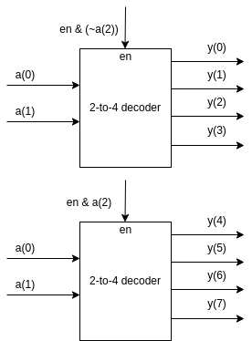

# 3-to-8 Decoder using 2-to-4 Decoders

# Truth Table

| en | a(2) | a(1) | a(0) | bcode      |
|----|------|------|------|------------|
| 0  |  -   |  -   |  -   | 00000000   |
| 1  |  0   |  0   |  0   | 00000001   |
| 1  |  0   |  0   |  1   | 00000010   |
| 1  |  0   |  1   |  0   | 00000100   |
| 1  |  0   |  1   |  1   | 00001000   |
| 1  |  1   |  0   |  0   | 00010000   |
| 1  |  1   |  0   |  1   | 00100000   |
| 1  |  1   |  1   |  0   | 01000000   |
| 1  |  1   |  1   |  1   | 10000000   |

## Block Diagram

The block diagram below works, observer carefully: 

