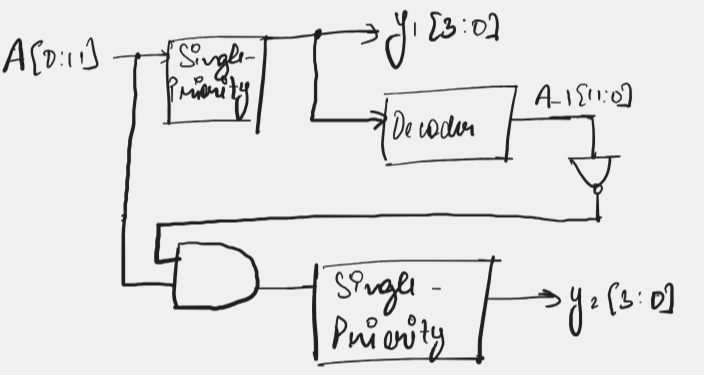

# Dual Priority Encoder

## Single Priority Encoder

First, before jumping into the dual-priority, let's see how a single priority encoder works.

I have implemented a 4-to-2 priority encoder. Let this inputs be `A_0, A_1, A_2, A_3` and the output be `O_1, O_2`. Now, if I set a priority order, `A_0, A_1, A_2, A_3` (in order of highest to lowest priority), what I mean is that say `A_1` and `A_3` high at once, then I should get output corresponding to `A_1` as it is at a higher priority. Using this logic, we can construct the following truth table: 

| `A_0` | `A_1` | `A_2` | `A_3` | `O_1` | `O_2` |
|:-----:|:-----:|:-----:|:-----:|:-----:|:-----:|
|   1   |   x   |   x   |   x   |   0   |   0   |
|   0   |   1   |   x   |   x   |   0   |   1   |
|   0   |   0   |   1   |   x   |   1   |   0   |
|   0   |   0   |   0   |   1   |   1   |   1   |

Now, using if and else statements in verilog, we can easily synthesize this circuit. 

Below are the simulation results: 

## Dual Priority

The experiment wants us to build a dual priority encoder of the following description: "The input is a 12-bit r e q signal and the outputs are f i r s t and second, which are the 4-bit
binary codes of the highest and second-highest priority requests, respectively."

But what exactly do they mean by this? Let's break it down.

We have a 12-bit input just like we had a 4-bit input in the single-priority encoder above. For this, we need 4-bit output size (minimum). Now, in this case we have two outputs say `y_1` and `y_2` each 4-bits in size. The first output contains the code for the first priority active bit and the second output contains the code for the second priority active bit. This much explanation should be enough I believe. 

So the logic which I will be using to construct this would be as follows: Get the highest priority output using single priority encoder (the first output), then use a decoder to get a single-bit active string, invert it and then multiply (AND) it with the original input, then pass this through another single priority encoder to get the second priority (the second output).

Below is the circuit diagram:

Now, here is the truth table for the single-priority encoder being used here, obviously we can't use the one above in this case.

| A[0:11]          | Y[0:3] |
|------------------|--------|
| 1XXXXXXXXXXX     | 0000   |
| 01XXXXXXXXXX     | 0001   |
| 001XXXXXXXXX     | 0010   |
| 0001XXXXXXXX     | 0011   |
| 00001XXXXXXX     | 0100   |
| 000001XXXXXX     | 0101   |
| 0000001XXXXX     | 0110   |
| 00000001XXXX     | 0111   |
| 000000001XXX     | 1000   |
| 0000000001XX     | 1001   |
| 00000000001X     | 1010   |
| 000000000001     | 1011   |

And here is the decoder's truth table: 

| D[0:3]| O[0:11]          |
|-------|------------------|
| 0000  | 100000000000     |
| 0001  | 010000000000     |
| 0010  | 001000000000     |
| 0011  | 000100000000     |
| 0100  | 000010000000     |
| 0101  | 000001000000     |
| 0110  | 000000100000     |
| 0111  | 000000010000     |
| 1000  | 000000001000     |
| 1001  | 000000000100     |
| 1010  | 000000000010     |
| 1011  | 000000000001     |

I have made the encoder (s_prior_1.v), decoder (decoder.v) in separate files. Below is the waveform output of the dual priority encoder: 

