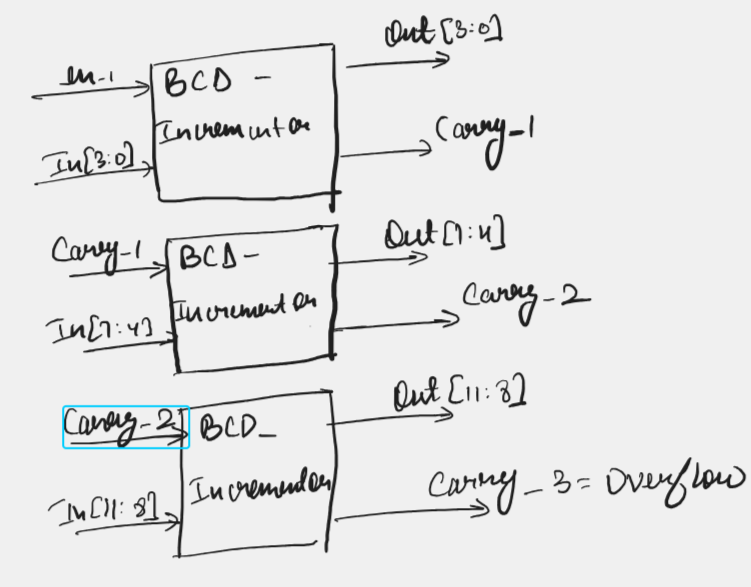

# BCD Incrementor

Our first goal in this problem statement is to first implement a BCD incrementor for a single decimal digit, then we will see that using that module, we can extend it to 3 digits. 

The table below represents the input and output of the single decimal digit BCD incrementor (single_BCD_incrementor.v): 

| en | Input | Output | Carry |
|:--:|:-----:|:------:|:-----:|
| 0  | A     | A      |   0   |
| 1  | 0000  | 0001   |   0   |
| 1  | 0001  | 0010   |   0   |
| 1  | 0010  | 0011   |   0   |
| 1  | 0011  | 0100   |   0   |
| 1  | 0100  | 0101   |   0   |
| 1  | 0101  | 0110   |   0   |
| 1  | 0110  | 0111   |   0   |
| 1  | 0111  | 1000   |   0   |
| 1  | 1000  | 1001   |   0   |
| 1  | 1001  | 0000   |   1   |

Now see the block diagram below and see why I have added en in the BCD Incrementor: 

See how I am using the carry from the previous BCD-Incrementor as the enable for the current incrementor. When, the carry in the previous incrementor is 1, then the current incrementor is enabled and the digit gets incremented, else, the current incrementor just outputs the input and gives out 0 carry. For the last incrementor, I have labeled carry as overflow. When overflow flag will be down, then we know that the output is a valid 3 digit decimal number, else we know that the increment went off to 4th digit for which we don't have adequate hardware. 

Below are the waveform simulation results: 

